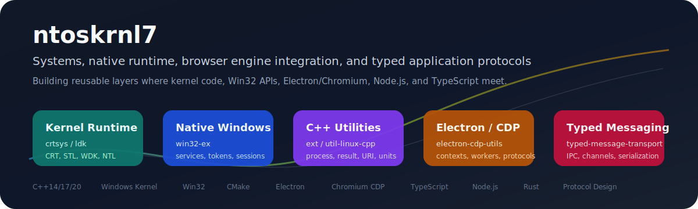

  

# Jung-Kwang Lee / ntoskrnl7

I build runtime software where ordinary application code meets constrained systems: Windows kernel drivers, native Win32 APIs, Chromium/Electron internals, media pipelines, and typed transports for TypeScript and Rust.

Most of my work is about making hard boundaries usable: kernel/user mode, native/browser, main/renderer, worker/process, protocol/runtime, and missing behavior in stock runtimes.

  
  
  
  
  
  

## What I Build

| Area | Signal |
| --- | --- |
| Systems runtime | C/C++ runtime support inside Windows kernel-driver constraints. |
| Native Windows | Practical wrappers around services, processes, sessions, tokens, handles, and security APIs. |
| Browser runtime | Chromium/Electron source changes for product features that stock builds do not expose cleanly. |
| Typed boundaries | Request/reply contracts across workers, MessagePort, Node.js processes, and WebSocket-style transports. |
| Portability | Libraries and build scripts that survive old MSVC, MinGW, Linux, macOS, Electron majors, and Chromium upgrades. |

## Highlighted Projects

| Project | Core idea | Why it matters |
| --- | --- | --- |
| [crtsys] | C/C++ runtime library for Windows kernel drivers. | Brings CRT/STL-like development patterns, C++ runtime features, and driver helpers into a restricted WDK environment. |
| [win32-ex] | Native Win32 extension layer. | Turns noisy service, process, session, token, privilege, SID, and security-descriptor code into reusable C++ APIs. |
| [ext] | Portable C++ utility library. | Collects the small building blocks real systems keep needing: `result`, process control, pipes, callbacks, URI/version parsing, strings, units, and compatibility helpers. |
| [electron-port-workspace] | Reusable Electron/Chromium feature-port workspace. | Carries source-level features such as Linux VA-API HEVC/H.265 work, Widevine packaging, preload coverage, trusted input dispatch, text state APIs, print/dialog handling, and browser identity fixes across Electron targets. |
| [electron-cdp] | Typed DevTools Protocol helpers for Electron. | Makes CDP sessions, command/event typing, context tracking, iframe/worker attachment, evaluation, and serialization easier to use from TypeScript. |
| [electron-protocol-provider] | Application-style routing for Electron custom protocols. | Treats custom schemes as structured routes with methods, path parameters, request objects, responses, and context injection. |
| [typed-message-transport] | Type-safe message transport for JavaScript runtimes. | Keeps request/response contracts explicit across MessagePort, workers, Node.js processes, and other serializable transports. |
| [wsmq-rs] / [service-rs] | Rust messaging and service lifecycle experiments. | Explores protocol-buffer-backed WebSocket flows, request/reply handling, progress hooks, and pause/resume/stop service states. |
| [ts-default] / [isim-rs] | Small boundary-focused tools. | Covers tiny but useful API conventions such as explicit default values and Node/Rust native-addon experiments. |

## Engineering Themes

- Make restricted runtimes feel less isolated from normal application development.
- Prefer explicit contracts at process, protocol, worker, renderer, and native boundaries.
- Treat patches, build scripts, packaging, and upgrade notes as part of the product surface.
- Keep code portable across compilers, OS targets, SDK/WDK versions, Electron majors, and Chromium source trees.

## Toolbox

  
  
  
  
  
  
  
  
  

Also maintained: [ldk], [util-linux-cpp], [ci-version], and [i18next-cpp]. Some public forks are research and contribution branches around Electron, Chromium, CEF, LLDB/GDB/MI debugging, Windows internals, and driver techniques.

## Contact

For project-specific questions, open an issue in the relevant repository. For collaboration, start from the project closest to the runtime boundary you care about.

[crtsys]: https://github.com/ntoskrnl7/crtsys
[ldk]: https://github.com/ntoskrnl7/ldk
[win32-ex]: https://github.com/ntoskrnl7/win32-ex
[ext]: https://github.com/ntoskrnl7/ext
[util-linux-cpp]: https://github.com/ntoskrnl7/util-linux-cpp
[ci-version]: https://github.com/ntoskrnl7/ci-version
[i18next-cpp]: https://github.com/ntoskrnl7/i18next-cpp
[electron-cdp]: https://github.com/ntoskrnl7/electron-cdp
[electron-protocol-provider]: https://github.com/ntoskrnl7/electron-protocol-provider
[electron-port-workspace]: https://github.com/ntoskrnl7/electron-port-workspace
[typed-message-transport]: https://github.com/ntoskrnl7/typed-message-transport
[wsmq-rs]: https://github.com/ntoskrnl7/wsmq-rs
[service-rs]: https://github.com/ntoskrnl7/service-rs
[ts-default]: https://github.com/ntoskrnl7/ts-default
[isim-rs]: https://github.com/ntoskrnl7/isim-rs
